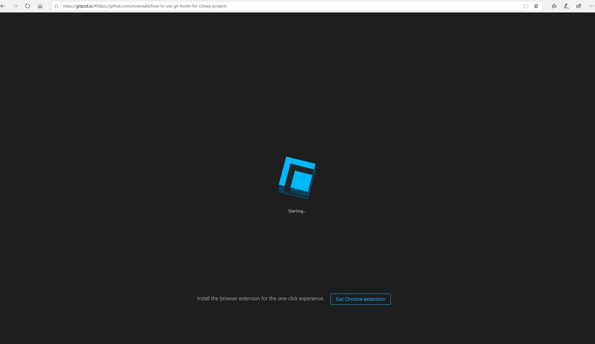

# Compile and run unit-tests via GIT hooks

This repository shows the usage of GIT hooks to compile and run unit tests automatically before your code gets committed and/or pushed. For demonstration, we're using a simple C# net core project. Using GIT hooks for this purpose gives you the following advantages:

1. All code that is committed to GIT compiles.
2. All code that is pushed to the remote repository passes all unit tests.

Disadvantages:

- Committing and pushing slows down

The idea for this scripts was based on the following issues:

- CI (e.g. Jenkins) doesn't check all temporary branches, e.g. short-living feature- or bugfix-branches that are going to be merged to the production branch.
- Developers don't check the CI outcome (which is very sad, but not uncommon at daily work ...)
- Increase feedback time. You'll get "instant" feedback on commit/push if your code is ok or if you messed up something.

To implement above-mentioned GIT behavior the following points need to be realized:

1. Your code has to be compilable via the cmd-line.
2. You need to create GIT hook scripts and update the hook directory of your local GIT repository (or tell GIT to point to a directory containing your hooks -> see [initGitHooks.ps1](https://github.com/moerwald/how-to-use-git-hooks-for-csharp-projects/blob/master/initGitHooks.ps1) ).

## Make your solution compilable via cmd-line

In this repository [Nuke](https://nuke.build) is used to define the steps to build a .net core "HelloWorld" console app and a dummy "Helloworld" unit test project. The corresponding build project is located in the [build](https://github.com/moerwald/how-to-use-git-hooks-for-csharp-projects/tree/master/build) directory. The build project, `build.ps1` and `build.sh` were generated via the [Nuke](https://nuke.build) wizard, by calling ```nuke :setup``` on the command line. `build.ps1` acts as a proxy to the cmd-line app, which is the output of [_build.csproj](https://github.com/moerwald/how-to-use-git-hooks-for-csharp-projects/blob/master/build/_build.csproj). Each target defined in [Build.cs](https://github.com/moerwald/how-to-use-git-hooks-for-csharp-projects/blob/master/build/Build.cs) is proxied by the ```-target``` parameter of ```build.ps1```. Based on that the code can be compiled via:

```
> .\build.ps1 -target compile
```

Unit-tests can be run via:

```
> .\build.ps1 -target test
```

## Create GIT hooks and add their directory into your local GIT repository

Hooks used in this repository are located under [.githooks](https://github.com/moerwald/how-to-use-git-hooks-for-csharp-projects/tree/master/.githooks). I decided to write the scripts in PowerShell because:

* I'm working the most time under Windows
* I like the object-oriented idea of PowerShell
* PowerShell runs under Windows, Linux, and Mac

The directory contains two bash scripts (```pre-commit``` and ```pre-push```) that are used to fire up a PowerShell process executing the corresponding `ps1` files. Since ```pre-commit``` and ```pre-push``` are Bash scripts they can be extended to work under Linux too. To see this in action just use this GitPod [link](https://gitpod.io/#https://github.com/moerwald/how-to-use-git-hooks-for-csharp-projects/tree/master/.githooks)). Since GIT doesn't offer a post-clone hook we have the tell GIT to use our custom pre-commit and pre-push after the initial clone of this repository. This can be done by invoking [initGitHooks.ps1](https://github.com/moerwald/how-to-use-git-hooks-for-csharp-projects/blob/master/initGitHooks.ps1). After that GIT calls below scripts:

* ```pre-commit.ps1```: Called every time you perform a commit to the local GIT repository.
* ```pre-push.ps1```: Called every time you try to push the changes of your local GIT repo to the remote one.

Let's take a look a the hook scripts in detail.

```pre-commit.ps1```:

```PowerShell

. $PSScriptRoot/helpers.ps1
. $PSScriptRoot/functionsToInterfaceAgainst.ps1

function Invoke-PreCommit {
    Invoke-InStashedEnvironment { 
        $status = git status -s
        if (!$status -or $status.Count -eq 0){
            Write-Warning "git status -s didn't return any changes!"
            return
        }

        if (Test-RelevantFileChanged -changedFile $status) {
            Invoke-BuildScript -target compile

            Write-LastExitCode
            if ($LASTEXITCODE -ne 0) {
                throw "It seems you code doesn't compile ... Fix compilation error(s) before commiting"
            }
        }
    }
}

```

The script sources a `helper.ps1`-file, containing common functions used by `pre-commit.ps1` and `pre-push.ps1`. In addition `functionsToInterfaceAgainst.ps1` is sourced. With the help of `functionsToInterfaceAgainst.ps1` the base flow is decoupled from the user's needs ( a user can change the function implementations to adapt to her needs).
`Invoke-InStashedEnvironment` stashes ALL files (regardless if indexed or not) to ensure that the compile operation is only called with the code, that is going to be committed. `Invoke-InStashedEnvironment` takes a `scriptblock`-object as a parameter, which is invoked after the stash operation. After `scriptblock` invocation the old workspace state is restored.
In the stashed environment ```git status``` is used to find the changed filenames, the outcome is stored in the `$status` array. `Test-RelevantFileChanged` decides if one of the files has a `cs` or `csproj` suffix. If so, the code has to be compiled before commit. `Test-RelevantFileChanged` and `Invoke-BuildScript` are located in `functionsToInterfaceAgainst.ps1`. It is assumed that `Invoke-BuildScript` sets PowerShell's automatic variable `$LASTEXITCODE` to value unequal zero (in case of failure). If so, the commit process is canceled by the `throw` statement. In the background, `Invoke-BuildScript` calls ```build.ps1``` with the ```compile``` target. The target is defined in [Build.cs](https://github.com/moerwald/c-sharp-git-hooks/blob/feature/repo-description/build/Build.cs).

The same pattern is used during the GIT push process.

```pre-push.ps1```:

```PowerShell

. $PSScriptRoot/helpers.ps1
. $PSScriptRoot/functionsToInterfaceAgainst.ps1

function Invoke-PrePush {

    $actGitBranch = git rev-parse --abbrev-ref HEAD
    if (Test-RelevantFileChanged -changedFile @(git diff --stat --cached "origin/$actGitBranch")) {
        Invoke-InStashedEnvironment { 
            Invoke-BuildScript -target test
        }
        Write-LastExitCode
        if ($LASTEXITCODE -ne 0) {
            Write-BrokenUnitTests
            throw "Unit tests are broken, won't push changes to remote repository"
        }
    }
}

Invoke-PrePush

```

The main difference is the fetching of changed files (the ones to be pushed). Here the `diff` command is used via:

```
git diff --stat --cached "origin/$actGitBranch"
```

As done in `pre-commit.ps1`, we scan the list of files for changed `cs`- or `csproj`-files. If the check is `true` we call our build script with the `test`-target. In the case of unit tests fail `$LASTEXITCODE` shall be unequal to zero, which causes an exception to be thrown. To present the user which tests failed the user-specific `Write-BrokenUnitTests` function is called. Our C# dummy projects create a `trx` file that is scanned and dumped to the user.

... Note: Creation of the trx files has to be done via MSBUILD, check the `VSTestLogger` XML entry in [HelloWorld.Tests.csproj](https://github.com/moerwald/how-to-use-git-hooks-for-csharp-projects/blob/84cbab0c960e04825ba4a8cd7507e66aa47d558e/src/project-cmd-line-app/HelloWorld/HelloWorld.Tests/HelloWorld.Tests.csproj#L15).

The `HelloWorld` playground projects are a good base to play around with the hooks, but testing the scripts by changing the several sources is quite annoying. Therefore  [githooks-tests](https://github.com/moerwald/how-to-use-git-hooks-for-csharp-projects/tree/master/githooks-tests) folder contains some [Pester](https://github.com/pester/Pester) tests verifying correct behavior. The tests can be invoked on the cmd-line via `githooks-tests> Invoke-Pester`.

Below are some GIFs representing the outcome of the hook scripts:

**Commit, everything is ok**


**Push, everything is ok**


**Push, unit test(s) fail**


# GitPod "Playground"

If you want to try the hooks live just click on this [GitPod link](https://gitpod.io/#https://github.com/moerwald/how-to-use-git-hooks-for-csharp-projects). The GIT hooks are automatically registered during the workspace startup. To play around with the scripts change a `cs` file, call `git add *.cs` and `git commit`. The hooks will automatically compile the code. Afterwards, you can check the push hook via `git push --dry-run`.


