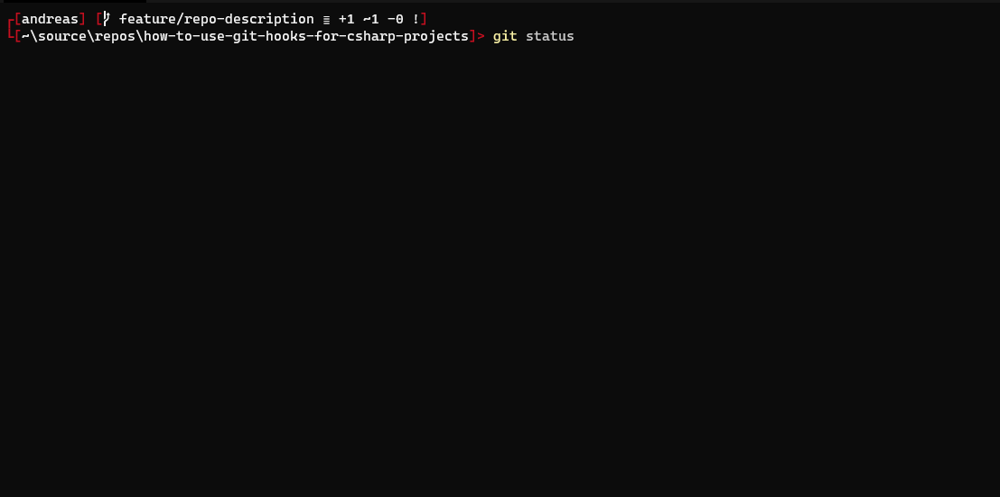
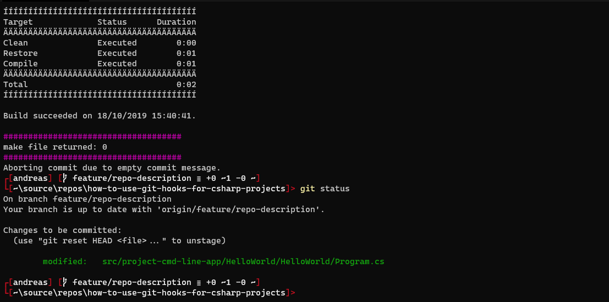
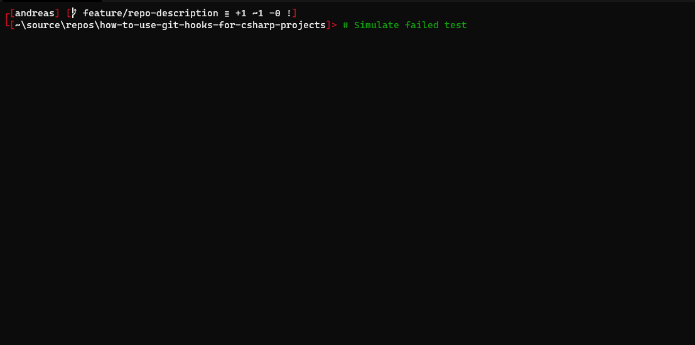

# c-sharp-git-hooks

This repo shall show the usage of GIT hooks to compile and run unit tests automatically before your code gets commited and/or pushed. For demonstration we're using a simple C# net core project (under Windows). Using GIT hooks for this purpose gives you the following advantages:

1. All code that is commited to GIT compiles.
2. All code that is pushed to the remote repo passes all unit tests.
3. Faster feedback than via CI, that might build the code in a time triggered manner.

Disadvantages:

1. Committing and pushing slows down
2. Depending on your language of choice the code might still be broken after pushing it to GIT. This will be the case if you've forgotten to add a source file to the index.

We all know the problem where we've to perform bugfixes shortly before a deadline ends. You do some minor changes in the code, sync them up to the remote repository and tell your colleague/boss that the code can be shipped. You leave the office, and receive an email some minutes or hours later, complaining that the code doesn't even compile. And even worse, your commit was the one that broke the code. Wouldn't it be great if your version control system (in our case GIT) compiles your before commiting it, and even better run the unit tests before pushing your changes to remote repo (and of course declining the push)?

To achive this two things have to be realized:

1. Your code has to be compilable via the cmd-line.
2. You need to add to create appropriate GIT hooks and update the hook directory of your local GIT repository.

## Make your solution compilable via cmd-line

In this repository I'm using [Nuke](https://nuke.build) to define build the steps to build a .net core HelloWorld console app and a dummy Helloworld unit test project. [Nuke](https://nuke.build) defines the several build steps in C#, the corresponding project is located in the build directory. The build project, build.ps1 and build.sh were generated via the [Nuke](https://nuke.build) wizzard, by calling ```nuke :setup``` on the command line. build.ps1 acts more or less as proxy to the cmd-line app, that is the output of ```_build.csproj```. Each target defined in [Build.cs](https://github.com/moerwald/c-sharp-git-hooks/blob/feature/repo-description/build/Build.cs) is proxied by the ```-target``` parameter of ```build.ps1```. Based on that you're able to build your software via:

```
> .\build.ps1 -target compile
```

and you're also able to run the unit tests via:

```
> .\build.ps1 -target test
```

## Create GIT hook and hook their directory into GIT

Hooks used in this repo are located under ```.githooks```. The directory contains four files, where the ```pre-commit``` and ```pre-push``` are used fire up a PowerShell process executing the corresponding ps1 files. Since ```pre-commit``` and ```pre-push``` are Bash scripts they can be extended to work under Linux too (you'll only need to install PowerShell core). Because GIT doesn't offer a post-clone hook we've the tell GIT to use our custom pre-commit and pre-push after the initial clone of this repository. This can be done by simply calling ```initGitHooks.ps1```. After calling this script GIT will call:

* ```pre-commit.ps1``` every time you perform a commit to the local GIT repository.
* ```pre-push.ps1``` every time you try to push the changes of your local GIT repo to the remote one.

Let's take a look a the hook scripts in detail.

```pre-commit.ps1```:

```PowerShell
$status = git status -s

# Git status returns files to be commited with a 'M' right at the start of the line, files
# that have change BUT are not staged for commit are marked as ' M', notice the space at the
# start of the line.
if ($status | Where-Object { ($_ -match "^M.*\.cs$") -or ($_ -match ".*.csproj") }){
	& "$PScriptRoot/../build.ps1" -target compile
	Write-Host "####################################" -ForegroundColor Magenta
	Write-Host ("make file returned: {0}" -f $LASTEXITCODE)
	Write-Host "####################################" -ForegroundColor Magenta
	if ($LASTEXITCODE -ne 0) {
		throw "It seems you code doesn't compile ... Fix compilation error(s) before commiting"
	}
}
```

First we retrieve the changed files via ```git status```. Files to be commited will be marked with a leading "M" at the start of each line. Via the ```Where-Object``` cmdlet we scan every line of ```git status``` if either a cs or csproj are marked for the commit. If so, we call Nukes ```build.ps1``` script with the ```compile```, which is defined in [Build.cs](https://github.com/moerwald/c-sharp-git-hooks/blob/feature/repo-description/build/Build.cs). After the build script has finished we it's exit via `$LASTEXITCODE`. If it is not equal to zero we will fire an exception, causing the commit process to be aborted. Based on these actions we ensure that the solution is compiled every time when a cs or a csproj file is requested for a local GIT commit.

The same pattern is used during the GIT push process.


```pre-push.ps1```:

```PowerShell

$actGitBranch = git rev-parse --abbrev-ref HEAD
$filesToBePushed = git diff --stat --cached "origin/$actGitBranch"

if ($filesToBePushed | Where-Object { ($_ -match ".*.cs") -or ($_ -match ".*.csproj") } ){
	# Call build script and check result code
	& "$PScriptRoot/../build.ps1" -target test
	Write-Host "####################################" -ForegroundColor Magenta
	Write-Host ("make file returned: {0}" -f $LASTEXITCODE)
	Write-Host "####################################" -ForegroundColor Magenta
	if ($LASTEXITCODE -ne 0) {
		# Get broken unit tests
		Write-Host "`nFollowing tests failed: " -ForegroundColor Red
		Get-ChildItem "$PSScriptRoot/../" -Include '*.trx' -Recurse | ForEach-Object {
			$testResult = [xml](Get-Content $_)
			$testResult.TestRun.Results.UnitTestResult | Where-Object { $_.outcome -eq "Failed" } | ForEach-Object {
				Write-Host "`t - $($_.testname)" -ForegroundColor Red
			}
		}

		Write-Host ""
		throw "Unit tests are broken, won't push changes to remote repository"
	}
}

```

To retrieve the files to be pushed to the remote repository we use GIT `diff` via `git diff --stat --cached "origin/$actGitBranch"`. As done in `pre-commit.ps1` we scan the list of files for change cs or csproj files. If check is `true` we call our buildscript with the `test` target. In case of one or more unit tests fail `$LASTEXITCODE` will be not eqaul to zero. To present the user which tests failed we retrieve the content of the testresult files (*.trx).

... Note: Creation of the trx files has to be done via MSBUILD, check the `VSTestLogger` XML entry in HelloWorld.Tests.csproj.

To stop the push process the script will throw an exception.

To sum things up here is the output of the hook scripts.

Commit, everything is ok:



Push, everything is ok:



Push, unit test(s) fail:


